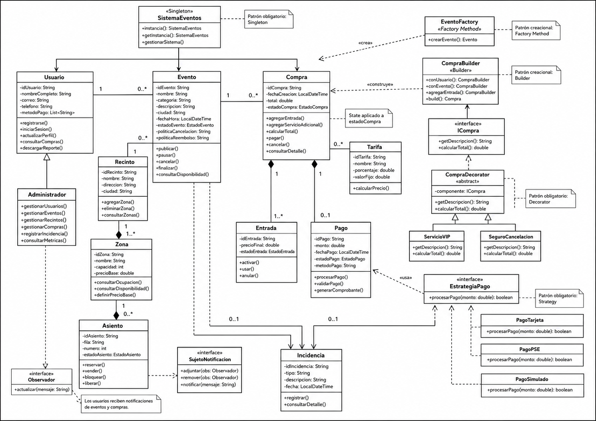

# Pensamiento Computacional RF-043

## Plataforma de gestión de eventos y venta de entradas

**Programación II - Universidad del Quindío**

**Integrantes:**  
Kebyn Julián Ochoa Pérez – Laura Vanessa Guerrero Blanco

---

## 1. Abstracción

### ¿Qué se solicita finalmente?

Diseñar un sistema orientado a objetos para una plataforma de gestión de eventos y venta de entradas, donde los usuarios puedan explorar eventos, seleccionar zonas o asientos, realizar compras, agregar servicios adicionales, pagar, recibir entradas y consultar reportes.

Además, el sistema debe permitir que un administrador gestione usuarios, eventos, recintos, zonas, asientos, compras, incidencias y métricas de ventas. El diseño debe aplicar principios SOLID y patrones de diseño creacionales, estructurales y de comportamiento antes de iniciar la codificación.

---

### ¿Qué información es relevante?

- **Usuarios:** personas que usan la plataforma para registrarse, iniciar sesión, consultar eventos, comprar entradas, gestionar su perfil, consultar historial de compras y descargar reportes.
- **Administradores:** personal de operaciones encargado de gestionar usuarios, eventos, recintos, zonas, asientos, compras, incidencias y métricas.
- **Eventos:** actividades programadas como conciertos, obras de teatro o conferencias. Tienen nombre, categoría, descripción, ciudad, fecha, estado, políticas y recinto asociado.
- **Recintos:** lugares físicos donde se realizan los eventos. Cada recinto tiene nombre, dirección, ciudad y varias zonas.
- **Zonas:** sectores dentro de un recinto, como VIP, Preferencial o General. Cada zona tiene capacidad, precio base y puede tener asientos numerados.
- **Asientos:** unidades individuales dentro de una zona. Pueden estar disponibles, reservados, vendidos o bloqueados.
- **Compras:** representan la adquisición de entradas por parte de un usuario. Tienen estado, total, fecha de creación, entradas, servicios adicionales y pago asociado.
- **Entradas:** tickets generados cuando una compra es pagada. Cada entrada tiene zona, asiento opcional, precio final y estado.
- **Pagos:** proceso mediante el cual el usuario confirma una compra usando métodos de pago simulados.
- **Tarifas:** reglas o cálculos que determinan el precio final de las entradas.
- **Servicios adicionales:** acceso VIP, seguro de cancelación, merchandising, parqueadero o acceso preferencial.
- **Incidencias:** situaciones anómalas como doble compra de asiento, error de pago o cancelación masiva de un evento.
- **Reportes y métricas:** ventas por periodo, ocupación por zona, ingresos por servicios adicionales, tasa de cancelación y top eventos.

---

### ¿Cómo se agrupa la información relevante?  
### Clases y estructura

#### Módulo de usuarios

**Clases principales:** Usuario, Administrador, MetodoPago.

**Métodos principales:** registrarse(), iniciarSesion(), actualizarPerfil(), consultarCompras(), descargarReporte(), gestionarUsuarios().

#### Módulo de eventos

**Clases principales:** Evento, EstadoEvento, EventoFactory.

**Métodos principales:** crearEvento(), publicar(), pausar(), cancelar(), consultarDisponibilidad().

#### Módulo de recintos, zonas y asientos

**Clases principales:** Recinto, Zona, Asiento, EstadoAsiento.

**Métodos principales:** agregarZona(), consultarOcupacion(), consultarDisponibilidad(), reservar(), vender(), bloquear(), liberar().

#### Módulo de compras y entradas

**Clases principales:** Compra, EstadoCompra, Entrada, EstadoEntrada.

**Métodos principales:** agregarEntrada(), agregarServicioAdicional(), calcularTotal(), pagar(), cancelar(), generarEntrada().

#### Módulo de pagos

**Clases principales:** Pago, MetodoPago, PagoService.

**Métodos principales:** procesarPago(), validarPago(), generarComprobante().

#### Módulo de tarifas y servicios adicionales

**Clases principales:** Tarifa, ServicioAdicional, ServicioVIP, SeguroCancelacion, Merchandising, Parqueadero.

**Métodos principales:** calcularPrecio(), getDescripcion(), getPrecio().

#### Módulo de incidencias

**Clases principales:** Incidencia, TipoIncidencia, IncidenciaService.

**Métodos principales:** registrar(), consultarDetalle(), consultarPorFecha(), consultarPorTipo().

#### Módulo de reportes

**Clases principales:** GeneradorReporte, GeneradorReporteCSV, GeneradorReportePDF, PanelMetricas.

**Métodos principales:** generarReporte(), generarCSV(), generarPDF(), mostrarMetricas().

---

### ¿Qué funcionalidades se solicitan?

- **F1:** Registrar e iniciar sesión de usuarios.
- **F2:** Gestionar perfil y métodos de pago simulados.
- **F3:** Explorar eventos con filtros por fecha, ciudad, categoría y precio.
- **F4:** Consultar detalle de eventos con descripción, lugar, fecha, aforo, zonas, precios y reglas.
- **F5:** Seleccionar entradas por zona o asiento según disponibilidad.
- **F6:** Crear, modificar y cancelar compras antes del pago.
- **F7:** Pagar compras y consultar comprobantes.
- **F8:** Visualizar estados de compra.
- **F9:** Agregar servicios adicionales a la compra.
- **F10:** Consultar historial de compras con filtros.
- **F11:** Descargar reportes en CSV o PDF.
- **F12:** Gestionar usuarios desde el perfil administrador.
- **F13:** Gestionar eventos: crear, actualizar, eliminar, listar, publicar, pausar y cancelar.
- **F14:** Gestionar recintos, zonas y asientos.
- **F15:** Controlar disponibilidad de asientos.
- **F16:** Registrar incidencias.
- **F17:** Consultar métricas de ventas, ocupación e ingresos.
- **F18:** Visualizar métricas con JavaFX Charts.
- **F19:** Generar entradas después del pago.
- **F20:** Anular entradas en caso de cancelación o reembolso.

---

## 2. Descomposición

El sistema se descompone en módulos independientes con responsabilidades claramente separadas:

### Módulo de Gestión de Usuarios

**Clases principales:** Usuario, Administrador, MetodoPago.

**Requisitos relacionados:** RF-001, RF-002, RF-012, RF-020, RF-021, RF-022.

### Módulo de Gestión de Eventos

**Clases principales:** Evento, EstadoEvento, EventoFactory.

**Requisitos relacionados:** RF-003, RF-004, RF-013, RF-023, RF-024, RF-025.

### Módulo de Recintos, Zonas y Asientos

**Clases principales:** Recinto, Zona, Asiento, EstadoAsiento.

**Requisitos relacionados:** RF-005, RF-014, RF-015, RF-026, RF-027, RF-028, RF-029, RF-030, RF-031, RF-032, RF-033.

### Módulo de Compras

**Clases principales:** Compra, EstadoCompra, Entrada, EstadoEntrada.

**Requisitos relacionados:** RF-006, RF-008, RF-010, RF-034, RF-035, RF-036, RF-037, RF-038, RF-039, RF-040.

### Módulo de Pagos

**Clases principales:** Pago, MetodoPago, PagoService.

**Requisitos relacionados:** RF-007, RF-016.

### Módulo de Servicios Adicionales

**Clases principales:** ServicioAdicional, CompraDecorator, ServicioVIP, SeguroCancelacion, Merchandising, Parqueadero, AccesoPreferencial.

**Requisitos relacionados:** RF-009.

### Módulo de Incidencias

**Clases principales:** Incidencia, TipoIncidencia, IncidenciaService.

**Requisitos relacionados:** RF-017, RF-041, RF-042.

### Módulo de Reportes y Métricas

**Clases principales:** GeneradorReporte, GeneradorReporteCSV, GeneradorReportePDF, PanelMetricas.

**Requisitos relacionados:** RF-011, RF-018, RF-019, RF-046.

---

## 3. Reconocimiento de patrones

Los patrones se reconocen a partir de las pistas textuales del enunciado y de las necesidades del sistema.

### Singleton

**Tipo:** Creacional.

**Clases sugeridas:** SistemaEventos.

**Justificación:** Se aplica porque el sistema necesita una única instancia central para coordinar operaciones importantes como ventas, disponibilidad, pagos o sesión de la plataforma.

### Factory Method

**Tipo:** Creacional.

**Clases sugeridas:** EventoFactory, ConciertoFactory, TeatroFactory, ConferenciaFactory.

**Justificación:** Se aplica porque el sistema debe crear diferentes tipos de eventos sin acoplar el código cliente a clases concretas.

### Builder

**Tipo:** Creacional.

**Clases sugeridas:** CompraBuilder.

**Justificación:** Se aplica porque una compra puede construirse paso a paso: seleccionar evento, zona, asiento, servicios adicionales, método de pago y confirmación.

### Decorator

**Tipo:** Estructural.

**Clases sugeridas:** CompraDecorator, ServicioVIP, SeguroCancelacion, Merchandising, Parqueadero.

**Justificación:** Se aplica porque una compra puede tener servicios adicionales agregados dinámicamente sin modificar la clase Compra original.

### Adapter

**Tipo:** Estructural.

**Clases sugeridas:** ReporteAdapterPDF, ReporteAdapterCSV.

**Justificación:** Se aplica porque el sistema puede necesitar exportar reportes usando librerías externas como PDFBox o Apache POI.

### Facade

**Tipo:** Estructural.

**Clases sugeridas:** CompraFacade.

**Justificación:** Se aplica para simplificar operaciones complejas como validar disponibilidad, reservar asiento, calcular tarifa, pagar y generar entradas.

### Strategy

**Tipo:** Comportamiento.

**Clases sugeridas:** EstrategiaPago, PagoTarjeta, PagoPSE, PagoSimulado, EstrategiaCancelacion.

**Justificación:** Se aplica porque el sistema necesita diferentes formas de calcular tarifas, descuentos, políticas de cancelación o métodos de pago.

### Observer

**Tipo:** Comportamiento.

**Clases sugeridas:** ObservableEvento, ObservadorUsuario, NotificadorEmail, NotificadorSMS.

**Justificación:** Se aplica porque los usuarios deben recibir notificaciones cuando cambia el estado de un evento o de una compra.

### State

**Tipo:** Comportamiento.

**Clases sugeridas:** CompraCreada, CompraPagada, CompraConfirmada, CompraCancelada, CompraReembolsada.

**Justificación:** Se aplica porque Evento, Compra, Asiento y Entrada cambian de estado durante el proceso y cada estado permite acciones diferentes.

---

## 4. ¿Cómo se distribuyen las funcionalidades?

### Usuario

**Responsabilidades:** registrarse(), iniciarSesion(), actualizarPerfil(), consultarEventos(), seleccionarEntrada(), realizarCompra(), pagarCompra(), consultarHistorial(), descargarReporte(), solicitarCancelacion().

### Administrador

**Responsabilidades:** crearEvento(), actualizarEvento(), eliminarEvento(), publicarEvento(), pausarEvento(), cancelarEvento(), gestionarRecintos(), gestionarZonas(), gestionarAsientos(), gestionarUsuarios(), gestionarCompras(), registrarIncidencia(), consultarMetricas().

### Evento

**Responsabilidades:** consultarDisponibilidad(), cambiarEstado(), obtenerZonas(), validarPoliticas().

### Recinto

**Responsabilidades:** agregarZona(), eliminarZona(), consultarZonas().

### Zona

**Responsabilidades:** consultarOcupacion(), consultarAsientosDisponibles(), calcularDisponibilidad().

### Asiento

**Responsabilidades:** reservar(), vender(), bloquear(), liberar().

### Compra

**Responsabilidades:** agregarEntrada(), eliminarEntrada(), agregarServicio(), calcularTotal(), confirmarPago(), cancelar(), cambiarEstado().

### Pago

**Responsabilidades:** procesar(), validar(), generarComprobante().

### Entrada

**Responsabilidades:** generar(), activar(), usar(), anular().

### Incidencia

**Responsabilidades:** registrar(), asociarAEvento(), asociarACompra(), consultar().

### GeneradorReporte

**Responsabilidades:** generarCSV(), generarPDF().

---

## 5. ¿Qué debo hacer para probar las funcionalidades?

### Datos de prueba necesarios

- Usuarios normales registrados.
- Un administrador.
- Eventos publicados, pausados y cancelados.
- Recintos con varias zonas.
- Zonas VIP, Preferencial y General.
- Asientos disponibles, reservados, vendidos y bloqueados.
- Compras creadas, pagadas, confirmadas y canceladas.
- Entradas activas y anuladas.
- Pagos simulados exitosos y fallidos.
- Servicios adicionales.
- Incidencias registradas.

### Casos de prueba principales

#### Registro e inicio de sesión

Crear un usuario, validar que pueda iniciar sesión y actualizar su perfil.

#### Consulta de eventos

Crear varios eventos, filtrar por ciudad, fecha, categoría y precio, y consultar detalle.

#### Selección de asiento

Consultar asientos disponibles, seleccionar uno, cambiar su estado a RESERVADO y evitar doble selección.

#### Creación de compra

Crear una compra, agregar una entrada, agregar servicios adicionales y calcular el total.

#### Pago de compra

Procesar un pago simulado, cambiar la compra a PAGADA, generar entradas y cambiar el asiento a VENDIDO.

#### Cancelación de compra

Cancelar una compra según política, anular entradas y liberar asientos si aplica.

#### Servicios adicionales

Agregar VIP, seguro o parqueadero y verificar que el total aumente correctamente.

#### Incidencias

Simular error de pago, registrar incidencia y consultarla por tipo y fecha.

#### Reportes

Generar reporte CSV de compras, reporte PDF de ventas y métricas de ocupación por zona.

---

## 6. ¿Qué puedo reutilizar?

### Interfaces reutilizables

- GeneradorReporte
- EstrategiaPago
- EstrategiaTarifa
- EstrategiaCancelacion
- ServicioAdicional
- Observador
- Observable

### Clases base reutilizables

- Usuario
- Evento
- Compra
- Entrada
- Pago
- Incidencia

### Enumeraciones reutilizables

- EstadoEvento
- EstadoCompra
- EstadoAsiento
- EstadoEntrada
- EstadoPago
- TipoIncidencia

### Patrones reutilizables

- Factory Method para crear distintos tipos de eventos.
- Builder para construir compras complejas.
- Decorator para agregar servicios adicionales.
- Strategy para cambiar métodos de pago, tarifas o políticas de cancelación.
- Observer para notificar cambios en eventos o compras.
- State para controlar los cambios de estado.
- Facade para simplificar el proceso completo de compra.
- Adapter para generar reportes con librerías externas.

---

## Diagrama de clases

